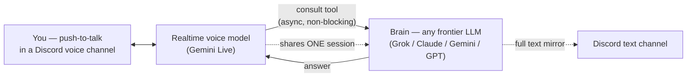

# True Jarvis — a voice agent with zero dead air and a frontier-LLM brain

**No delays. No awkward silences. No waiting while "it thinks." A live spoken assistant that answers the instant you stop talking — with the intelligence of the most advanced models available behind every real answer.**

That combination is supposed to be impossible. Realtime voice models answer instantly but are shallow; frontier reasoning models are brilliant but take seconds to start talking — and seconds of dead air kill a spoken conversation. Every voice assistant you've tried picked one side of that trade-off.

This build refuses the trade-off. You talk over Discord push-to-talk, from any device. Ask something simple — instant answer, natural voice, like a person on a call. Give it a real task — it says *"hold on, I'll take a look"*, keeps chatting with you, and comes back with the result moments later, in voice **and** in text. It feels like one continuous mind. Under the hood it's two very different models glued into a single persona — and this repo is the blueprint for the glue.

Built on [OpenClaw](https://openclaw.ai). Bring your own API keys, your own tools, and your own name for it (mine is called Isaac, after Asimov).

---

## The trick: two models, one persona

| Role | Model | Job |
|---|---|---|
| **The face** | Gemini Live (`gemini-3.1-flash-live-preview`) | Hears you, speaks, handles small talk, never goes silent |
| **The brain** | Any frontier LLM (I run Grok 4.5; Claude, Gemini or GPT drop in the same way) | Consulted behind the scenes for anything substantive; has the tools, the memory, the context |

The voice model treats the brain as *its own deeper mind* (via OpenClaw's `openclaw_agent_consult` tool) and is explicitly instructed to never mention backends. The user never meets two agents — there is only one character.

## The conversation pattern

```
You:    "You there?"
Agent:  "Yep, here."                                  ← voice answers directly, ~0 latency

You:    "Find yesterday's email from the court and summarize it."
Agent:  "Hold on, taking a look…"                     ← instant spoken acknowledgment
        (you can keep chatting — the voice stays responsive)
Agent:  "Found it. In short: …"                       ← brain's answer, spoken
        + the full text lands in a Discord text channel at the same time
```

- **Simple** → answered by the voice directly. Perceived latency: none.
- **Substantive** → immediate spoken ack, async delegation to the brain, spoken result when ready.
- **Long-running** → the brain works in the background; the result is *always* mirrored to text, because a voice session may not live long enough to speak it.

## Architecture



Key design decisions:

1. **Discord as the transport.** Free, reliable push-to-talk from any device, plus text channels and file sharing in the same place. No custom app needed.
2. **Full-duplex voice mode** (`bidi`): you can interrupt the agent mid-sentence, and it keeps listening while the brain works. The alternative (proxy mode, where every utterance blocks on the brain) is more reliable at delegation but goes silent for seconds at a time — exactly the dead air this build exists to eliminate.
3. **One session for voice and text.** By default every channel is a separate conversation with separate context. Routing the voice channel and the owner's DM into a single agent session is what makes the agent feel like one entity: what you said by voice, it remembers in text, and vice versa.
4. **Text mirroring as infrastructure, not instructions.** Asking the model to "always copy your answers to the channel" works 80% of the time. A tiny bridge script that tails the session log and posts every final answer to the text channel works 100% of the time. Instructions are suggestions; pipelines are guarantees.

## Configuration (the parts that matter)

Key names as of OpenClaw 2026.7.1. Fragments, not a full config — adapt to your setup.

```jsonc
{
  "agents": {
    "defaults": {
      "model": "xai/grok-4.5",          // the brain — swap for any frontier model
      "thinkingDefault": "high"
    }
  },
  "channels": {
    "discord": {
      "voice": {
        "mode": "bidi",                  // full-duplex: interruptible, never blocks
        "realtime": {
          "consultPolicy": "always",     // voice must consult the brain for real questions
          "providers": {
            "google": {
              "model": "gemini-3.1-flash-live-preview",
              "voice": "Enceladus",
              "languageCode": "ru-RU",   // any language Gemini Live supports
              "temperature": 0.2         // lower temp → more reliable tool-calling
            }
          }
        }
      }
    }
  }
}
```

### The voice instructions (the actual glue)

The single most important piece of prompt engineering in the system. The failure mode of `bidi` mode is that the voice model *answers from its own weights* instead of consulting the brain — and, counterintuitively, **short commands are the most likely to be swallowed** (in my logs: utterances under 5 s were delegated 14% of the time; over 20 s — 92%). The instructions attack exactly that:

```text
You are <NAME>, live in a Discord voice channel with your operator. You are one
persona with the full agent; the consult tool is your own deeper mind with memory
and tools — never mention backends. Tone: calm competent colleague.

CRITICAL — SHORT COMMANDS ARE STILL COMMANDS. Your biggest failure is treating a
short utterance as small talk and answering it yourself. Length means NOTHING —
a 2-second phrase can be a real task ("do it", "send it", "check the second one",
"go on"). Follow-ups in the middle of a task are the MOST important turns to
delegate — the operator is steering real work.

RULE: if the utterance refers to ANY action, file, message, email, person, case,
document, or continues a previous task — consult, with a complete self-contained
question (include what you were doing; your deeper mind may lack that context).
Answer yourself ONLY for pure greetings and acknowledgements.

When in doubt — CONSULT. A needless consult costs nothing; a dropped task means
the operator asked and nothing happened, the worst outcome.

Never leave silence: say a short phrase like "on it, sec" before consulting, keep
chatting while it runs, then state the result once, briefly, accurately. Never
claim something is done unless the consult result says so.
```

## Hard-won lessons

Things that cost me days, so they cost you nothing:

- **Delegation is probabilistic, not guaranteed.** `consultPolicy: "always"` is prompt-level — the realtime model can still decide your command was chit-chat. Targeted instructions (above) + low temperature raise the rate substantially. The hard guarantee is forcing function-calling at the API level (`functionCallingConfig: { mode: "ANY" }` for Gemini Live), at the cost of consulting even on "hi".
- **Voice sessions die quietly.** Google Live closes idle/unlucky sessions; the bridge can look perfectly healthy while being deaf-mute — it hears you, logs your speech, and never answers. A watchdog that counts *"user spoke N times, nothing answered"* in the current session and restarts the gateway is the difference between a toy and something you can rely on.
- **Speaking is not delivery.** If a task takes longer than the voice session lives, the spoken result evaporates. Every long-task result must also be delivered as text, unconditionally.
- **One brain, many mouths — sessions split by default.** If voice, DMs and the text channel are separate sessions, you get three agents with three memories wearing the same name. Unify them deliberately.
- **Windows specifics** (if you run it there natively): run the gateway as a Scheduled Task with battery-friendly settings; npm global installs from sandboxed contexts can land in an MSIX overlay that the real system can't see; always use forward slashes in paths you pass to exec tools.

## What is NOT in this repo

By design — this is the voice+brain pattern, not my personal assistant:

- No memory system (OpenClaw has one; configure to taste)
- No personal tools (email, documents, messengers, calendars — add your own as skills)
- No API keys, tokens, or configs with real IDs

Take the pattern, give it your own name, your own voice, and your own hands.

## Credits

- [OpenClaw](https://openclaw.ai) — the agent framework doing the heavy lifting: channels, sessions, the consult mechanism, tool plumbing
- Google **Gemini Live** — the realtime voice
- xAI **Grok 4.5** — the brain in my setup (fully swappable)

## License

MIT
